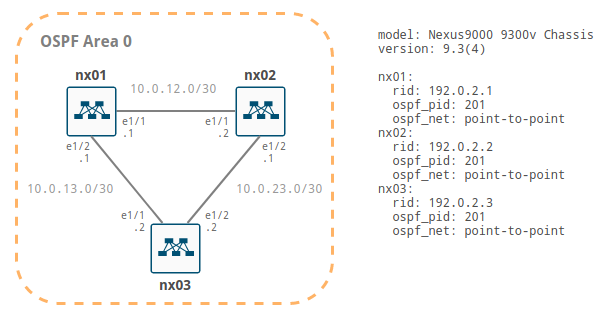

This Vagrant project demonstrates a single area OSPF point-to-point network topology with three Cisco Nexus 9000v nodes.

## Ingredients

  * [Vagrant](https://www.vagrantup.com)
  * [vagrant-libvirt](https://github.com/vagrant-libvirt/vagrant-libvirt)
  * [Cisco Nexus 9000v Vagrant box](https://github.com/mweisel/cisco-nxos9kv-vagrant-libvirt)
  * [Python](https://www.python.org) >= 3.5
  * [Ansible](https://www.ansible.com) >= 2.9

## Prerequisites

01\. Add a DHCP reservation for each Cisco Nexus 9000v management interface.

Refer to [Controlling Vagrant Box Management IP](https://codingpackets.com/blog/controlling-vagrant-box-management-ip) for more information.

<pre>
$ <b>virsh net-dumpxml vagrant-libvirt</b>
&lt;network ipv6='yes'&gt;
  &lt;name&gt;vagrant-libvirt&lt;/name&gt;
  &lt;uuid&gt;e9d9b270-22b2-46d9-a397-91ca3117430b&lt;/uuid&gt;
  &lt;forward mode='nat'&gt;
    &lt;nat&gt;
      &lt;port start='1024' end='65535'/&gt;
    &lt;/nat&gt;
  &lt;/forward&gt;
  &lt;bridge name='virbr1' stp='on' delay='0'/&gt;
  &lt;mac address='52:54:00:d9:f5:84'/&gt;
  &lt;ip address='192.168.121.1' netmask='255.255.255.0'&gt;
    &lt;dhcp&gt;
      &lt;range start='192.168.121.1' end='192.168.121.254'/&gt;
      &lt;host mac='<b>44:39:39:00:00:31</b>' ip='<b>192.168.121.31</b>'/&gt;
      &lt;host mac='<b>44:39:39:00:00:32</b>' ip='<b>192.168.121.32</b>'/&gt;
      &lt;host mac='<b>44:39:39:00:00:33</b>' ip='<b>192.168.121.33</b>'/&gt;
    &lt;/dhcp&gt;
  &lt;/ip&gt;
&lt;/network&gt;
</pre>

02\. Set the SSH client configuration for the Cisco Nexus 9000v nodes.

Refer to [Vagrant SSH Config Trick](https://codingpackets.com/blog/vagrant-ssh-config-trick) for more information.

<pre>
$ <b>tail -n +1 $HOME/.ssh/config $HOME/.ssh/vagrant.d/sshconfig</b>
==> /home/marc/.ssh/config <==
Include vagrant.d/sshconfig

==> /home/marc/.ssh/vagrant.d/sshconfig <==
### Cisco Nexus 9000v

Host nx01
  HostName 192.168.121.31
  User vagrant
  Port 22
  UserKnownHostsFile /dev/null
  StrictHostKeyChecking no
  PasswordAuthentication no
  IdentityFile ~/.vagrant.d/insecure_private_key
  IdentitiesOnly yes
  LogLevel FATAL

Host nx02
  HostName 192.168.121.32
  User vagrant
  Port 22
  UserKnownHostsFile /dev/null
  StrictHostKeyChecking no
  PasswordAuthentication no
  IdentityFile ~/.vagrant.d/insecure_private_key
  IdentitiesOnly yes
  LogLevel FATAL

Host nx03
  HostName 192.168.121.33
  User vagrant
  Port 22
  UserKnownHostsFile /dev/null
  StrictHostKeyChecking no
  PasswordAuthentication no
  IdentityFile ~/.vagrant.d/insecure_private_key
  IdentitiesOnly yes
  LogLevel FATAL
</pre>

## Steps

01\. Clone this GitHub repo and _cd_ into the `ansible` subdirectory.

<pre>
$ <b>git clone https://github.com/mweisel/cisco-nexus-ospf-p2p</b>
$ <b>cd cisco-nexus-ospf-p2p/ansible</b>
</pre>

02\. Create a Python virtual environment.

<pre>
$ <b>python3 -m venv .venv</b>
</pre>

03\. _Activate_ the Python virtual environment.

<pre>
$ <b>source .venv/bin/activate</b>
</pre>

04\. Update the `pip` and `setuptools` Python packages.

<pre>
$ <b>pip install -U pip setuptools</b>
</pre>

05\. _Reactivate_ the Python virtual environment.

<pre>
$ <b>deactivate && source .venv/bin/activate</b>
</pre>

06\. Install the `ansible` and `paramiko` Python packages.

<pre>
$ <b>pip install -r requirements.txt</b>
</pre>

07\. _Reactivate_ the Python virtual environment.

<pre>
$ <b>deactivate && source .venv/bin/activate</b>
</pre>

08\. Instantiate the Cisco Nexus 9000v nodes.

<pre>
$ <b>vagrant up --no-parallel</b>
</pre>

09\. Run the Ansible playbook to configure the Cisco Nexus 9000v nodes.

<pre>
$ <b>ansible-playbook set-config.yml</b>
</pre>

10\. Verify the configuration.

<pre>
$ <b>ssh nx02</b>
</pre>

<pre>
nx02# <b>show ip ospf neighbors</b>
nx02# <b>show ip ospf route</b>
nx02# <b>run bash for lo in 1 3; do ping -c5 192.0.2.${lo}; done</b>
</pre>

## License

This project is licensed under the MIT License - see the [LICENSE](LICENSE) file for details